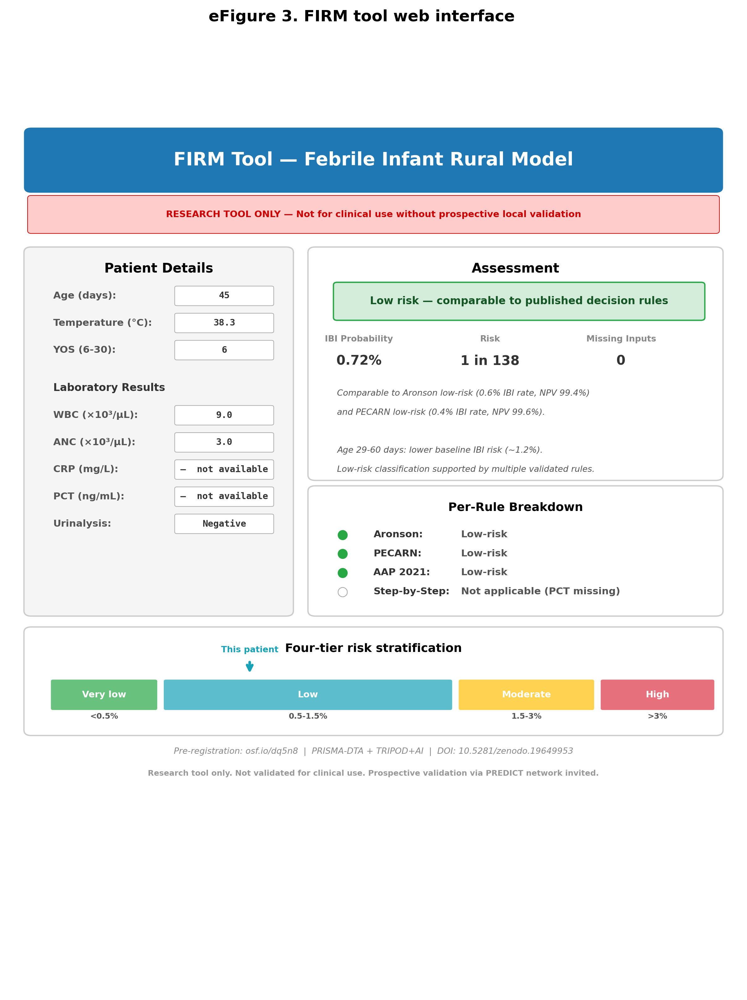

# FIRM Tool — Febrile Infant Rural Model

[](https://firm-tool.streamlit.app)

An interactive clinical decision support tool for febrile infants aged 0-89 days, designed for emergency departments without access to procalcitonin or a complete laboratory panel.

**RESEARCH TOOL ONLY** — not for clinical use without prospective local validation.



## What it does

The FIRM tool takes clinical and laboratory inputs available in a rural or regional emergency department and produces:

1. **A continuous IBI probability** (invasive bacterial infection: bacteraemia or meningitis)
2. **A four-tier risk classification** (very low / low / moderate / high)
3. **Comparison to published decision rules** (PECARN, Aronson, Step-by-Step, AAP 2021, Rochester)
4. **Age-specific clinical context** aligned with current guideline recommendations

Missing inputs are handled by median imputation rather than binary exclusion — the tool degrades gracefully when tests are unavailable.

## Try it

**Live demo:** https://firm-tool.streamlit.app

**Run locally:**

```bash
pip install -r requirements.txt
streamlit run streamlit_app.py
```

## Model

The prediction model is a logistic regression with 7 predictors:

| Predictor | Coefficient |
|-----------|-------------|
| Age (days) | -0.023 |
| Temperature (°C) | -0.099 |
| WBC (×10³/µL) | -0.150 |
| ANC (×10³/µL) | 0.233 |
| Urinalysis positive | 1.320 |
| YOS total score | 0.102 |
| Age ≤14 days | 0.310 |
| Intercept | -0.048 |

Derived from the PECARN Biosignatures public-use dataset (n=4,434 complete cases; 88 IBI events). Internally validated: optimism-corrected AUC 0.780 (95% CI 0.705-0.853), calibration slope 0.937.

Model coefficients are embedded in the source code — no external data or model files are required.

## Derivation study

Farquhar H. The FIRM Tool (Febrile Infant Rural Model): bivariate meta-analysis of published decision rules with individual-level prediction modelling.

- Pre-registration: https://osf.io/dq5n8/
- Analysis code: https://doi.org/10.5281/zenodo.19649953
- Preprint: to be posted

## Risk tiers

| Tier | P(IBI) | Interpretation |
|------|--------|----------------|
| Very low | <0.5% | Below residual IBI rate of all published rules |
| Low | 0.5-1.5% | Comparable to published "low-risk" groups |
| Moderate | 1.5-3% | Above published low-risk thresholds |
| High | >3% | IBI workup recommended |

## Validation status

This tool has been internally validated only. **It has not been externally validated in any clinical setting.** A three-phase validation programme is proposed in the derivation manuscript:

1. Retrospective external validation on an Australian cohort
2. Prospective silent-mode validation in rural/regional EDs
3. Clinical impact study (stepped-wedge or ITS design)

We invite the PREDICT network and other paediatric emergency research groups to undertake prospective validation.

## License

MIT License. See [LICENSE](LICENSE).

## Citation

```
Farquhar H. The FIRM Tool (Febrile Infant Rural Model): bivariate
meta-analysis of published decision rules with individual-level prediction
modelling. [Preprint]. 2026.
```
